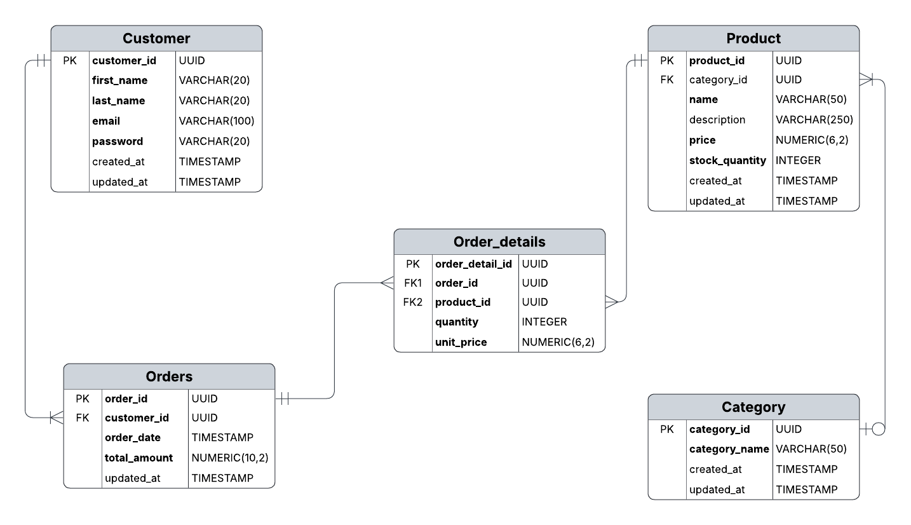

## E-commerce

### Entities

- **Customer**
- **Category**
- **Product**
- **Orders**
- **Order_details**

### DB schema script

```
CREATE TABLE Customer
(
  customer_id UUID DEFAULT gen_random_uuid(),
  first_name VARCHAR(20) NOT NULL,
  last_name VARCHAR(20) NOT NULL,
  email VARCHAR(100) NOT NULL UNIQUE,
  password VARCHAR(20) NOT NULL,
  created_at TIMESTAMP NOT NULL DEFAULT CURRENT_TIMESTAMP,
  updated_at TIMESTAMP NOT NULL DEFAULT CURRENT_TIMESTAMP,
  PRIMARY KEY (customer_id)
);

CREATE TABLE Category
(
  category_id UUID DEFAULT gen_random_uuid(),
  category_name VARCHAR(50) NOT NULL,
  created_at TIMESTAMP NOT NULL DEFAULT CURRENT_TIMESTAMP,
  updated_at TIMESTAMP NOT NULL DEFAULT CURRENT_TIMESTAMP,
  PRIMARY KEY (category_id)
);


CREATE TABLE Product
(
  product_id UUID DEFAULT gen_random_uuid(),
  category_id UUID,
  name VARCHAR(50) NOT NULL,
  description VARCHAR(250),
  author VARCHAR(50) NOT NULL,
  price NUMERIC(6,2) NOT NULL DEFAULT 0 CHECK (price >= 0),
  stock_quantity INTEGER NOT NULL DEFAULT 0 CHECK (stock_quantity >= 0),
  created_at TIMESTAMP NOT NULL DEFAULT CURRENT_TIMESTAMP,
  updated_at TIMESTAMP NOT NULL DEFAULT CURRENT_TIMESTAMP,
  PRIMARY KEY (product_id),
  FOREIGN KEY (category_id) REFERENCES Category(category_id) ON DELETE SET NULL
);

CREATE TABLE Orders
(
  order_id UUID DEFAULT gen_random_uuid(),
  customer_id UUID NOT NULL,
  order_date TIMESTAMP NOT NULL DEFAULT CURRENT_TIMESTAMP,
  total_amount NUMERIC(10,2) NOT NULL CHECK (total_amount >= 0),
  updated_at TIMESTAMP NOT NULL DEFAULT CURRENT_TIMESTAMP,
  PRIMARY KEY (order_id),
  FOREIGN KEY (customer_id) REFERENCES Customer(customer_id) ON DELETE CASCADE
);

CREATE TABLE Order_details
(
  order_detail_id UUID DEFAULT gen_random_uuid(),
  order_id UUID NOT NULL,
  product_id UUID NOT NULL,
  quantity INTEGER NOT NULL CHECK (quantity > 0),
  unit_price NUMERIC(6,2) NOT NULL DEFAULT 0 CHECK (unit_price >= 0),
  PRIMARY KEY (order_detail_id),
  FOREIGN KEY (order_id) REFERENCES Orders(order_id) ON DELETE CASCADE,
  FOREIGN KEY (product_id) REFERENCES Product(product_id)
);

CREATE TABLE Sale_History
(
    sale_id UUID DEFAULT gen_random_uuid(),
    order_id UUID NOT NULL,
    customer_id UUID NOT NULL,
    product_id UUID NOT NULL,
    quantity INTEGER NOT NULL,
    unit_price NUMERIC(6,2) NOT NULL,
    total_amount NUMERIC(10,2) NOT NULL,
    order_date TIMESTAMP NOT NULL,
    PRIMARY KEY (sale_id),
    FOREIGN KEY (order_id) REFERENCES Orders(order_id) ON DELETE CASCADE,
    FOREIGN KEY (customer_id) REFERENCES Customer(customer_id),
    FOREIGN KEY (product_id) REFERENCES Product(product_id)
);
```

### The relationships between entities

| Relationship              | Cardinality |
| ------------------------- | ----------- |
| `Category → Product`      | 1 → Many    |
| `Customer → Orders`       | 1 → Many    |
| `Orders → Order_details`  | 1 → Many    |
| `Product → Order_details` | 1 → Many    |

### ERD diagram



### SQL query to generate a daily report of the total revenue for a specific date

```
SELECT SUM(total_amount) AS total_revenue
FROM Orders
WHERE order_date::date = '2025-11-19';
```

### SQL query to generate a monthly report of the top-selling products in a given month

```
SELECT
    Order_details.product_id,
    Product.name,
    SUM(Order_details.quantity) AS total_quantity
FROM
    Order_details
JOIN
    Product ON Order_details.product_id = Product.product_id
JOIN
    Orders ON Order_details.order_id = Orders.order_id
WHERE
    EXTRACT(YEAR FROM Orders.order_date) = 2025 AND EXTRACT(MONTH FROM Orders.order_date) = 12
GROUP BY
    Order_details.product_id, Product.name
ORDER BY
    total_quantity DESC;
```

### SQL query to retrieve a list of customers who have placed orders totaling more than $500 in the past month

```
SELECT
    Orders.customer_id,
    Customer.first_name,
    Customer.last_name,
    SUM(Orders.total_amount) AS total_order_amount
FROM
    Orders
JOIN
    Customer ON Orders.customer_id = Customer.customer_id
WHERE
     EXTRACT(MONTH FROM Orders.order_date) = EXTRACT(MONTH FROM CURRENT_DATE - INTERVAL '1 month')
     AND EXTRACT(YEAR FROM Orders.order_date) = EXTRACT(YEAR FROM CURRENT_DATE - INTERVAL '1 month')
GROUP BY
    Orders.customer_id, Customer.first_name, Customer.last_name
HAVING
    SUM(Orders.total_amount) > 500
ORDER BY
    total_order_amount DESC;
```

### A denormalization on customer and order entities

```
ALTER TABLE Orders
ADD COLUMN customer_first_name VARCHAR(20),
ADD COLUMN customer_last_name VARCHAR(20),
ADD COLUMN customer_email VARCHAR(100);
```

### A SQL query to search for all products with the word "camera" in either the product name or description

```
SELECT * FROM Product WHERE name ILIKE '%camera%' OR description ILIKE '%camera%';
```

### A trigger to update Sale_History table when a new order is placed

```
CREATE OR REPLACE FUNCTION create_sale_history()
RETURNS TRIGGER AS $$
BEGIN
    INSERT INTO Sale_History(
        order_id,
        customer_id,
        product_id,
        quantity,
        unit_price,
        total_amount,
        order_date
    )
    SELECT
        Order_details.order_id,
        Orders.customer_id,
        Order_details.product_id,
        Order_details.quantity,
        Order_details.unit_price,
        Order_details.quantity * Order_details.unit_price,
        Orders.order_date
    FROM Order_details
    JOIN Orders ON Orders.order_id = Order_details.order_id
    WHERE Order_details.order_detail_id = NEW.order_detail_id;

    RETURN NEW;
END;
$$ LANGUAGE plpgsql;

CREATE TRIGGER after_order_detail_insert
AFTER INSERT ON Order_details
FOR EACH ROW
EXECUTE FUNCTION create_sale_history();
```

### A transaction query to lock the field quantity with product id = 211 from being updated

```
BEGIN;

SELECT quantity
FROM Product
WHERE product_id = 211
FOR UPDATE;

COMMIT;

EXCEPTION
    WHEN OTHERS THEN
        ROLLBACK;
END;
```

### A transaction query to lock row with product id = 211 from being updated

```
BEGIN;

SELECT *
FROM Product
WHERE product_id = 211
FOR UPDATE;

COMMIT;

EXCEPTION
    WHEN OTHERS THEN
        ROLLBACK;
END;
```
